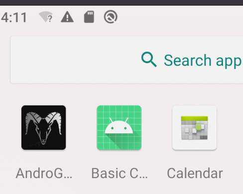

# intro-pentest-android-nerdearla101v2
Material e instructivo para el Workshop de nerdearla 101 v2

## Tools a instalar

### 1) Android studio

- Link a instalador [Android Studio](https://developer.android.com/studio?hl=es-419&gclid=Cj0KCQjw8amWBhCYARIsADqZJoUAwYoGPwVE4jteDV-fSnvaJGXJGAyQZXg2RRp7cSMKwRcHVlKGkMkaAuP2EALw_wcB&gclsrc=aw.ds).

No vamos a usar durante esta edicion del workshop esta tool, pero sirve para instalar otras tools como adb (platform-tools) o usar AVD.

### 2) adb

-Link a instruccion de como instalar [adb](https://www.xda-developers.com/install-adb-windows-macos-linux/).

Para probar esta tool:

```
adb --version
```

Debe mostrar un mensaje similar al siguiente:

```
Android Debug Bridge version 1.0.41
Version 31.0.3-7562133
Installed as /.../Library/Android/sdk/platform-tools/adb
```

### 3) emulador o celular rooteado

Hay muchisimos emuladores en el mercado. Los siguientes tienen versiones gratuitas y que se usan en el dia a dia para hacer pentests. Si alguien quiere instalar otro emulador, podra hacerlo y podra seguir con el Workshop pero no le daremos soporte durante ni antes del curso.

- Genymotion: [instrucciones](https://docs.genymotion.com/desktop/Get_started/Requirements/)
- AVD: viene instalado con Android Studio

Genymotion sirve para equipos que pueden instalar Virutalbox (actualmente cualquier equipo con el procesador Apple M1 no puede). Las maquinas virtuales que se generan son x86. Para el workshop va a ser suficiente, sin embargo para algunas aplicaciones este emulador no es suficiente.

AVD tiene distintos tipos de imagenes, para distintas arquitecturas de procesadores (ARMv7, ARMv8, x86). Corre sobre QEMU. Hoy en dia si se tiene un equipo con Apple M1 es la unica alternativa local. En caso de crear una imagen tener cuidado con la arquitectura de la misma porque si se elige una arquitectura que no es compatible con la del procesador del equipo fisico va a andar muy lento el emulador.

Imagenes para procesadores Intel:


Imagenes para procesadores ARM:


Para comprobar si anda bien la configuracion del emulador con adb (se necesita para instalar aplicaciones), ejecutar 

```
adb shell
```

Si esta andando bien deberia presentar una shell con un usuario:


### 4) jadx

- [Rep de github](https://github.com/skylot/jadx)

Corre sobre Java, por lo cual tiene que estar instalada en el OS y tiene que estar en el PATH. Para verificar que esta andando ejecutar en una terminal:

```
jadx-gui {path_to_this_repo}/androgoat.apk
```

y deberia abrir un aplicativo similar al siguiente:


5) frida

- [Instructivo de instalacion](https://frida.re/docs/installation/).

Para el setup ver video de Workshop de Frida (FALTA SUBIR VIDEO) 

Ejecutar: 

```
frida-ps -U
```

y deberia aparecer un resultado como el siguiente:



### 6) web proxy 

En el workshop vamos a usar mitmproxy, pero se puede utilizar cualquier web proxy que se prefiera. La eleccion de mitmproxy es porque es gratuito, no demanda muchos recursos del host en cuanto a CPU y RAM. 

- [mitmproxy](https://docs.mitmproxy.org/stable/overview-installation/).

Para el setup de mitmproxy en el emulador ver el siguiente video (FALTA SUBIR VIDEO)

### 7) instalacion de androgoat

Con el emulador o celular conectado a adb ejecutar:

```
adb install {{path_to_androgoat}}/androgoat.apk
```

Si se tiene exito, se podra ver la siguiente aplicacion dentro del OS de Android:


Si tienen algun problema o duda con respecto a este instructivo por favos sumense al siguiente Discord y pregunten: [Age of Entropy](https://discord.gg/vs56MHrTuv)!!!
